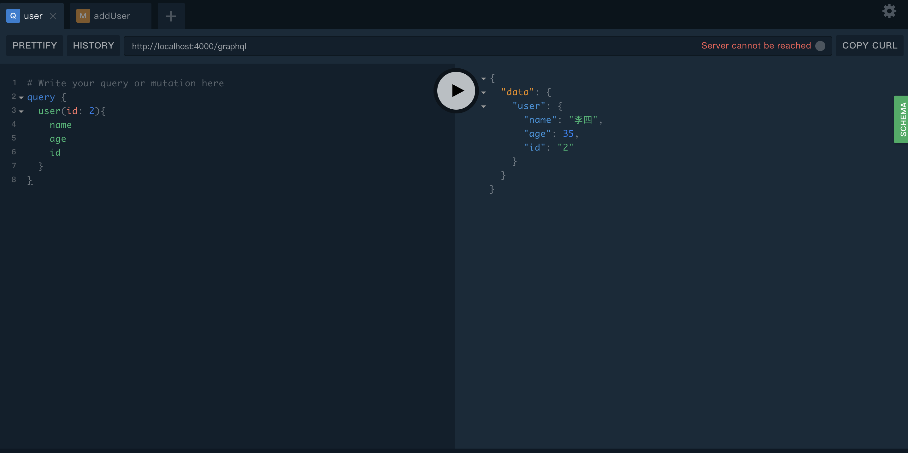
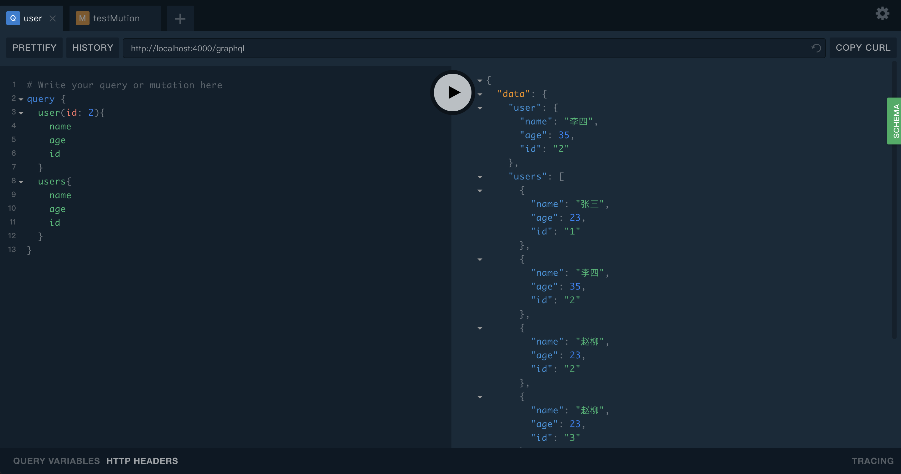
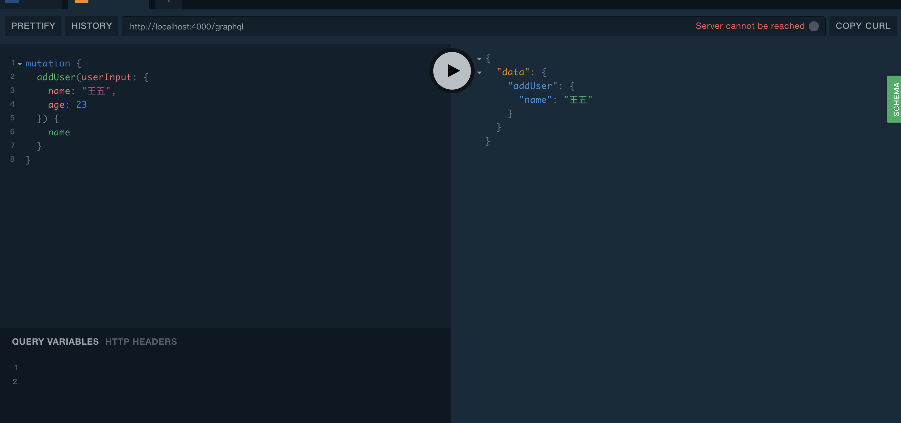
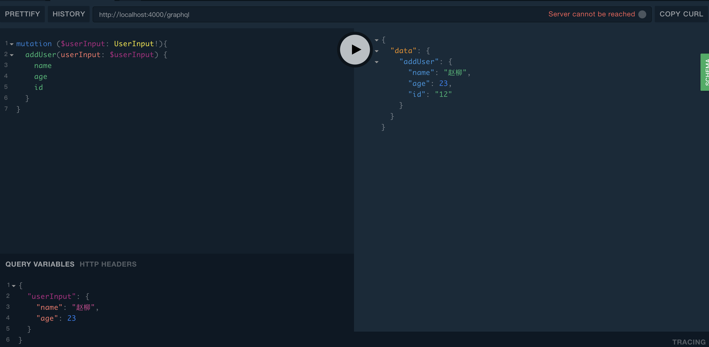
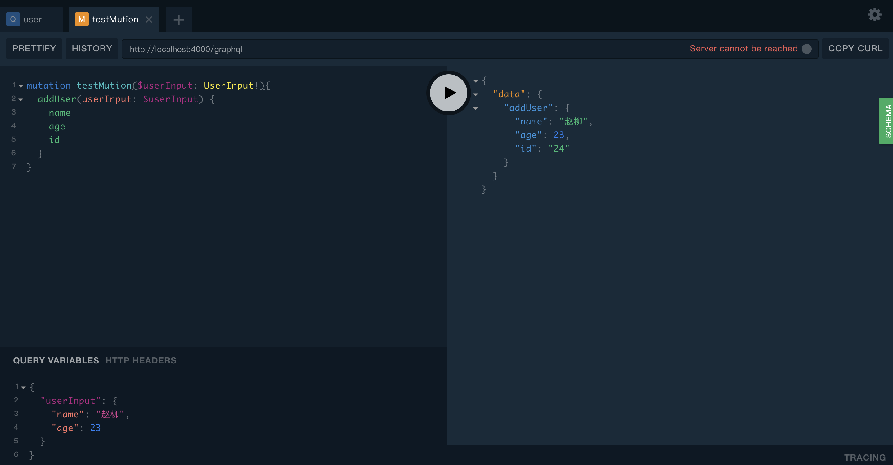
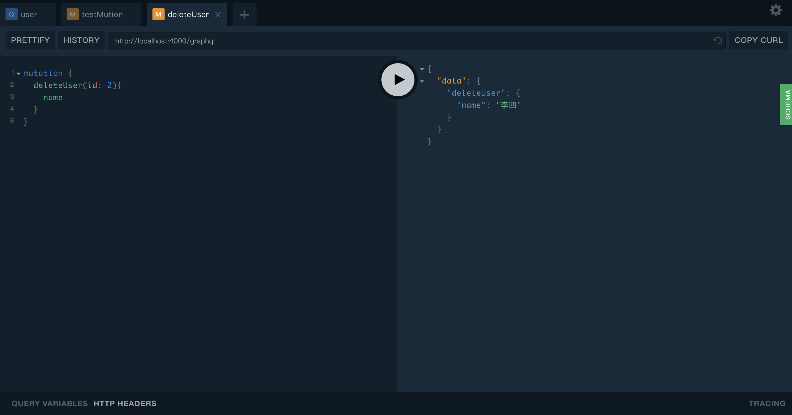
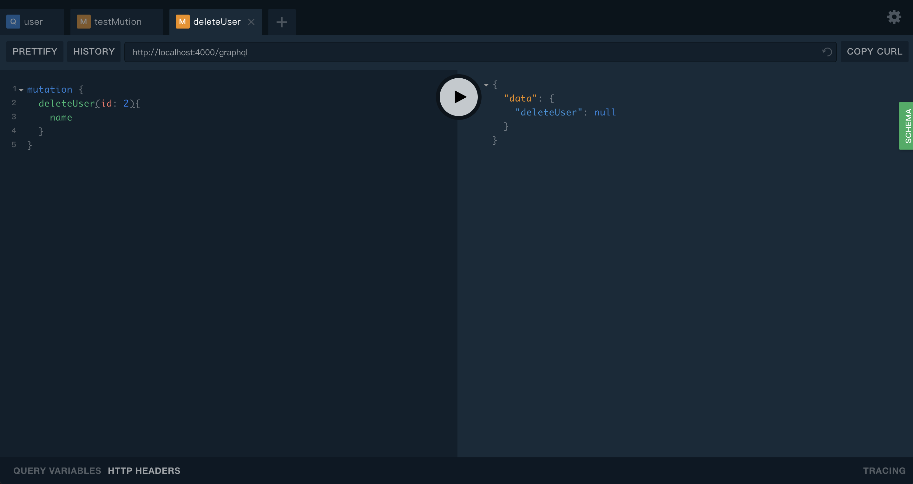
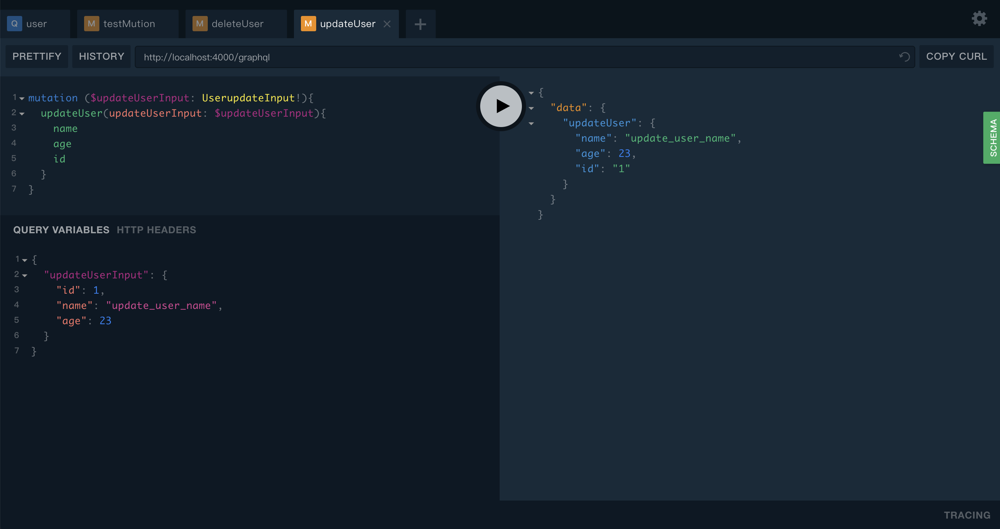
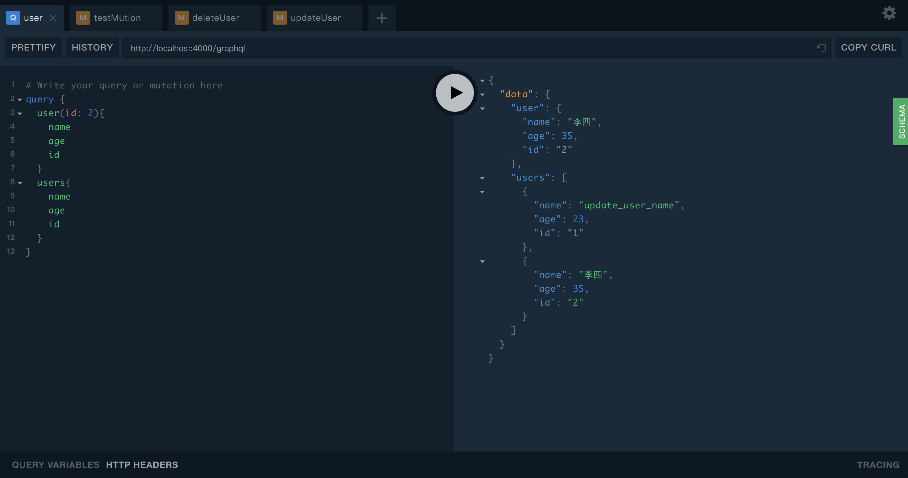
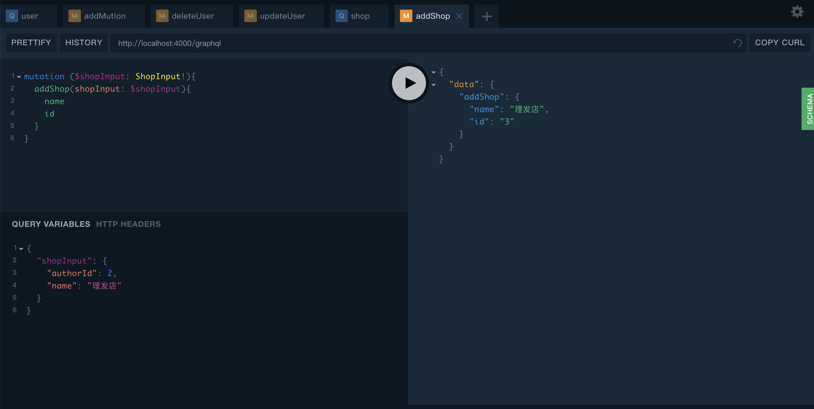

## 参考资料

- [graphql doc 生成文档](https://github.com/2fd/graphdoc)
- [graphql-import](https://www.npmjs.com/package/graphql-import)
- [graphql-import doc](https://oss.prisma.io/content/graphql-import/overview)
- [ts-node](https://github.com/TypeStrong/ts-node)
- [Oh-My-Zsh 操作 Git 的快捷键](https://segmentfault.com/a/1190000007145316)
- [node 怎么判断是开发环境还是生产环境？？](https://segmentfault.com/q/1010000007782377/a-1020000007782650)
- [cross-env](https://www.npmjs.com/package/cross-env)
- [mongoose 学习笔记（超详细）](https://segmentfault.com/a/1190000010688972#articleHeader14)

## 项目搭建流程

- [x] 启动 ts 项目，watch 自动重启
- [x] `findPoint` 启动项目 防止端口冲突
- [x] 判断环境
- [x] 接入 `graphql`
- [x] 使用 `.graphql` 文件 支持语法高亮
- [x] `npm run build` `.graphql` 文件处理
- [x] `.graphql` 单文件涵盖所有的 类型
- [x] 接入 `mongodb`
- [x] `mongodb model` 模型添加类型 typeof
- [ ] 查看 `graphql性能`
- [ ] relationship
- [ ] 指令
- [ ] 内联片段
- [ ] 元字段
- [ ] 分页
- [ ] `dataloader`
- [ ] `auth`

## Useage

- `npm run dev`
- `npm run build`

query




mutation

** 新增 **




** 删除 **



** 更新 **



** 添加多个 schema **


# docker 启动 mongo 容器

- docker-compose up -d
- docker ps

# 连接 mongo

## 查询

```graphql
# Write your query or mutation here
query {
  user(_id: "5c44396542389ec9c640dd7b") {
    name
    age
    _id
  }
  users {
    name
    age
    _id
  }
}
```

```json
{
  "data": {
    "user": {
      "name": "update_user_name",
      "age": 244,
      "_id": "5c44396542389ec9c640dd7b"
    },
    "users": [
      {
        "name": "update_user_name",
        "age": 244,
        "_id": "5c44396542389ec9c640dd7b"
      },
      {
        "name": "赵柳",
        "age": 23,
        "_id": "5c443b3740bda6ca3ccd4efd"
      }
    ]
  }
}
```
